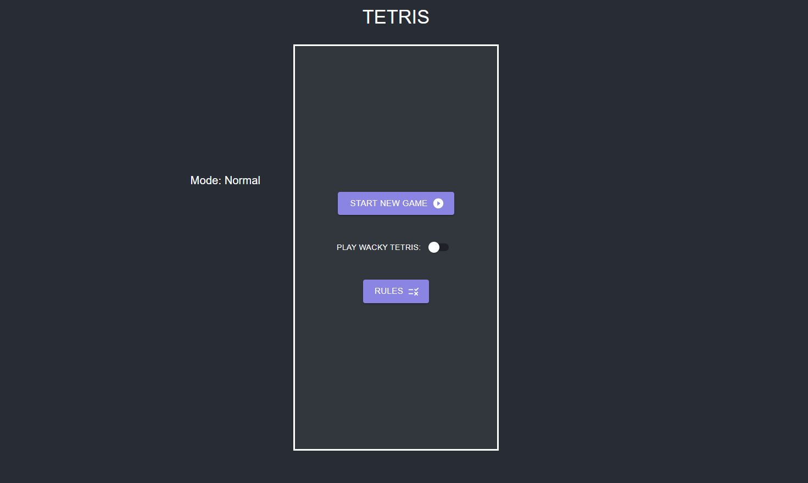
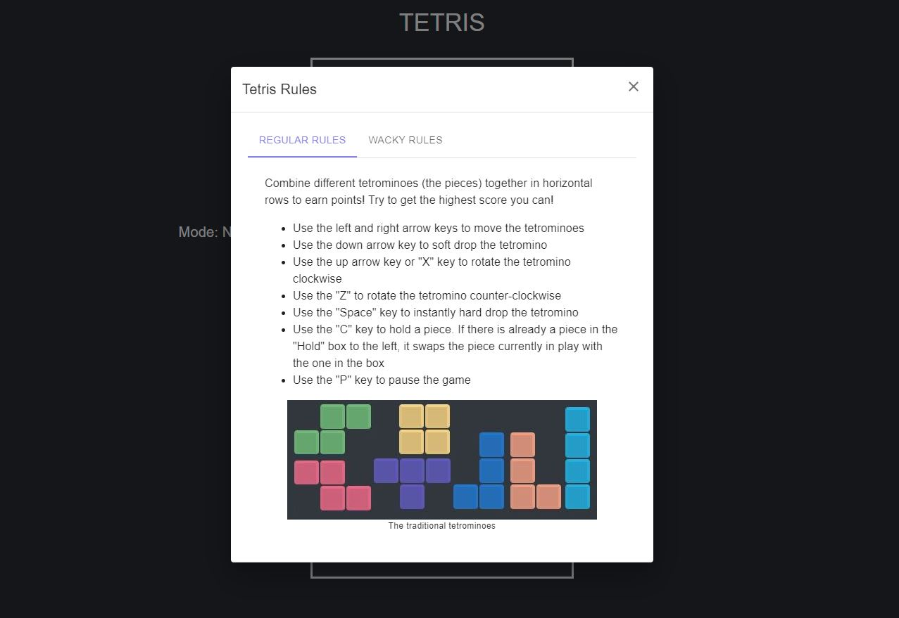
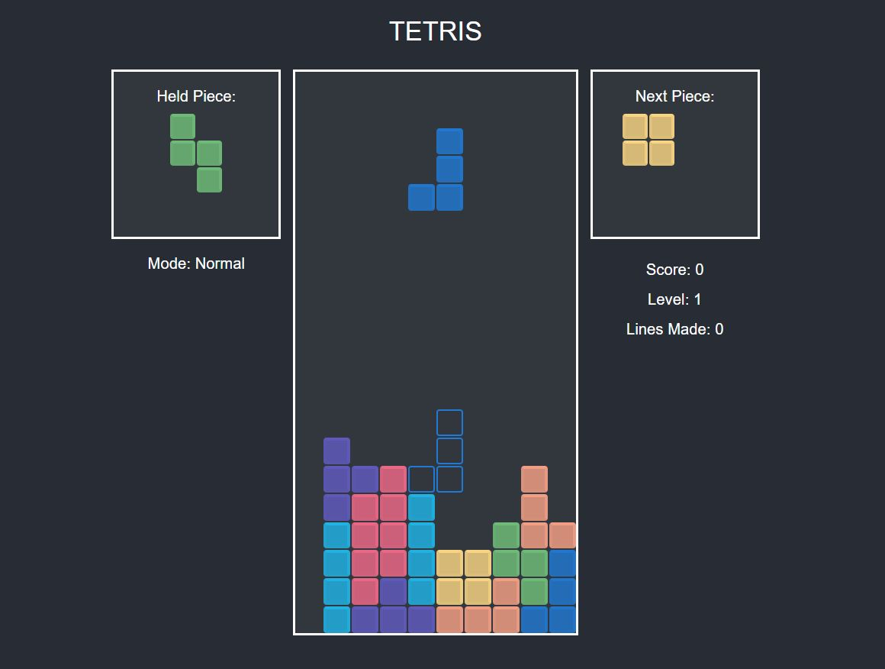
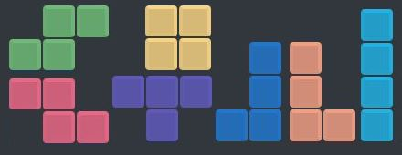
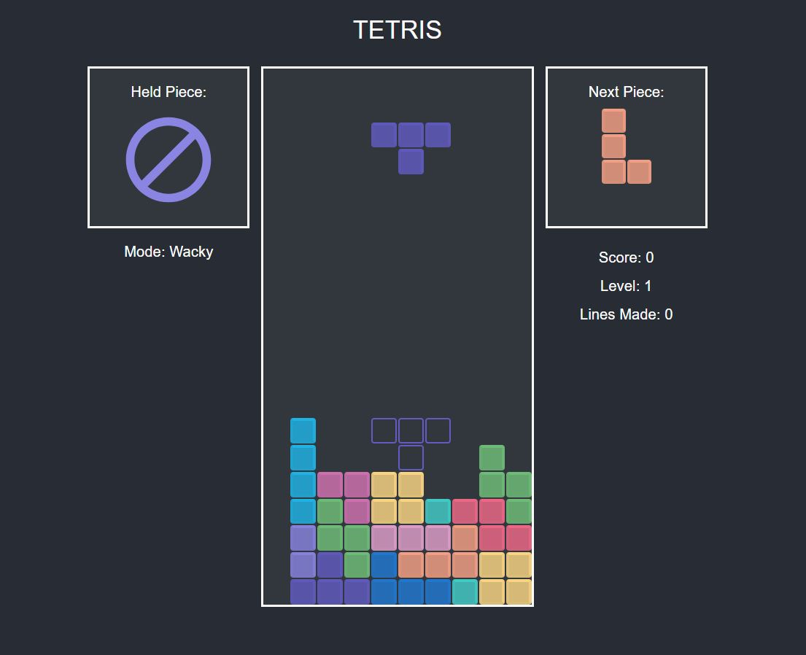
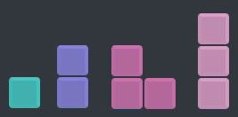

# Tetris App

This project was created and coded with React and JS. The goal of this project is to build knowledge in JS and continue working with the React library.

This app mostly follows this guide, but there are some additions and changes I did in this app: [https://www.youtube.com/watch?v=yCEIgEOZ36g&ab_channel=RestfulCoder](https://www.youtube.com/watch?v=yCEIgEOZ36g&ab_channel=RestfulCoder)

But it also follows and takes inspiration from these guides: 
- [https://www.youtube.com/watch?v=ZGOaCxX8HIU&ab_channel=freeCodeCamp.org](https://www.youtube.com/watch?v=ZGOaCxX8HIU&ab_channel=freeCodeCamp.org)
- [https://www.youtube.com/watch?v=HEsAr2Yt2do&ab_channel=CodeExplained](https://www.youtube.com/watch?v=HEsAr2Yt2do&ab_channel=CodeExplained)

## App Summary

- This app implements a tetris game with a special "wacky" mode
    - Switch to wacky mode with the toggle below the start game button
- Features a menu where player can specify which mode they want to play
    - Rules button to explain the rules and controls of the game
    - Two sections for normal mode and wacky mode \

- This app uses these following colors:
    -  `#282C34`: background
    -  `#32363D`: board background
    -  `#8A84E2` and  `#59588B`: buttons
    -  `#625BC2` (T piece),  `#207AD5` (J piece),  `#1FB7EA` (I piece),  `#72C07B` (S piece),  `#FFDA85` (O piece),  `#F9A287` (L piece),  `#F26989` (Z piece): original block colors
    -  `#8A84E2` (I 2 blocks piece),  `#44CFCB` (Dot piece),  `#D373B3` (V piece),  `#E2A1CC` (I 3 blocks piece): additional wacky block colors

### Normal Tetris

The current look of the tetris game in normal mode
- Features the original seven pieces: \

- Player can hold a piece

### Wacky Tetris

The current look of the tetris game in wacky mode
- Four more pieces are available: \

- Can't hold pieces

## Available Scripts

In the project directory, you can run:

### `npm start`

Runs the app in the development mode.\
Open [http://localhost:3000](http://localhost:3000) to view it in your browser.

The page will reload when you make changes.\
You may also see any lint errors in the console.
